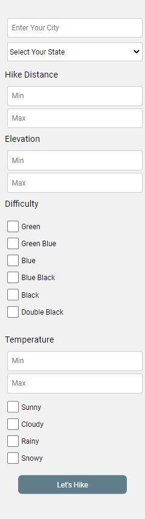
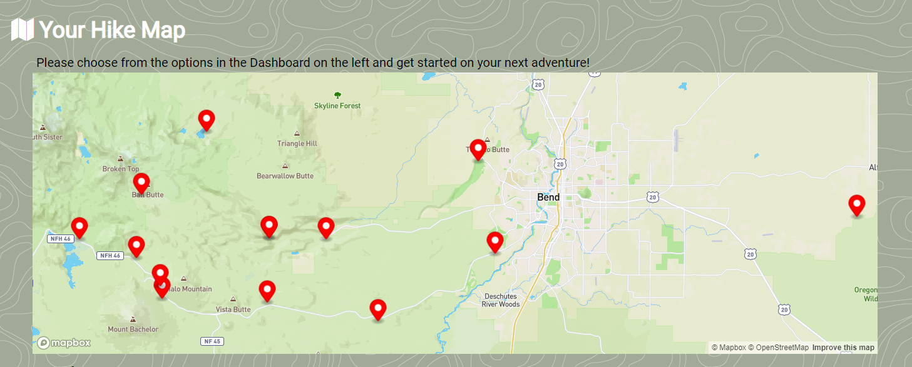
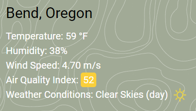
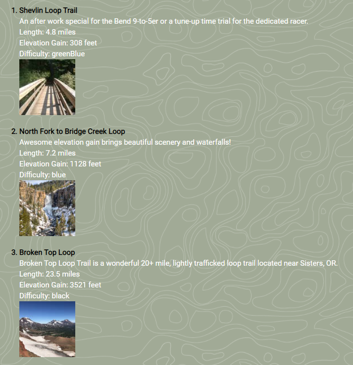

# Bootcamp_Project_1

# AirWalk

An app in which user can choose critera and find corresponding hikes in given area.

User may choose city, distance, elevation, difficulty and temperature to filter what hike they would like.

A Map will display hikes within the given parameters.

Below map will be listed

> - Weather Conditions
> - Temperature
> - Humidity
> - Wind Speed
> - Air Quality

Hikes will be listed in rows below with a picture and scenic description. Also listed will be

> - Length (miles)
> - Elevation (feet)
> - Difficulty

**Motivation**

Earlier this month, Congress passed the Great American Outdoors Act, which fully and permanently funded the Land and Water Conservation Fund and restore our national parks.  The LWCF maintains, protects, and expands trails and public hiking areas across America.    

According to AmericanHiking.org, 1 in every 6 people goes hiking every year, with more joining every day.

With the increase of hiking popularity and the stable funding of LWCF, we are sure to see a rise in the need for better and more detailed user hiking apps.

We created an app that provides a new hiker, or even the most seasoned trekker with all of the information they could need before they hit the trail.  First, we started with the basic information you would need to get started on your adventure: trail head location, the length of the hike, and the degree of difficulty the hiker can expect.  But we also included an elevation guide and weather conditions in the area, to include the temperature, wind speed, and humidity.  Now, adventurers can enjoy the season–any season–and have the confidence that their experience won’t be ruined by unfavorable conditions.

Also, as Americans everyday are becoming more environmentally and health-aware, we realized we should include the air quality index to allow users to consider pollutant amounts during their hike.      

With the sport growing in popularity and the ability to enjoy the outdoors year-round, Air Walk is the only resource needed to start your next outdoor adventure.

**How To Use**

1. Input a minimum of City and State into the search bar on the left side of the web page.  
2. Click on 'Lets Hike' button. 
3. Right portion of webpage will display interactive map with cursors that point out hikes that meet search parameters. 
4. Below map, scroll throw current weather forecast and list of hikes. 
5. Bottom right corner holds an arrow button that will scroll back to the top of webpage.  

**Code Example/How it Works**
  
  
**Tech/Framework Used/Tech Stack**

- HTML
- CSS
- JavaScript
- Third Party APIs 
- Web APIs

**Notes**

In future versions we hope to add more map information showing directions on how to get to a specified trail with traffic conditions (use a Google Maps API).  Also, be able to filter the “recommended” hiking days by temperature that the user inputs. We would like to add an additional map layer showing current weather systems in the region, and provide links to trail use information such as places to obtain day passes.

We'd also add the ability for users to leave and view reviews of their hikes. We'd like to make the app more interactive so users can connect it to their health apps, connect to their friends via the app, view the average time to finish the hike, average calories burned per hike, whether the hike has public facilities and if dogs or bikes are allowed on the path. Our goal is to be a one stop app for users to find all their information for their hikes. 

**_Links_**

Deployed URL: https://mx6.github.io/Bootcamp_Project_1/

Github Code URL: https://github.com/mx6/Bootcamp_Project_1 
